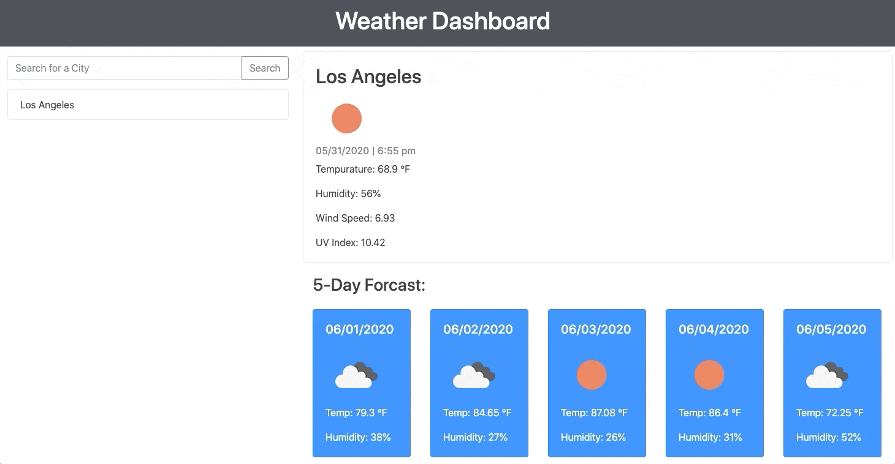

# Weather-Dashboard

This responsive application displays the current weather and weather forecast of a city that is search and saves the searched city. The search history is displayed under the search bar so you may click on any previously searched cities.

## Click [Here](https://kingsleyramos.github.io/Weather-Dashboard/) for deployed application.
---

## Tool & Resources
---
* [Bootstrap](https://getbootstrap.com/) - CSS framework used
* [JQuery](https://getbootstrap.com/) - JavaScript library used
* [Moment.js](https://momentjs.com/) - Date/Time API
* [OpenWeather API](https://openweathermap.org/api) - Weather data API

## Assignment Challenges
---
### Struggle 1: UNIX TIME

It took me a bit of time to figure out UNIX time but realized that moment.js can convert UNIX to any format. Another issue I ran into, which I did not know until I spoke to a fellow classmate, was the time that was in the first element of the array within the forecast was the weather at 3 am. I had to select the time that was to about midday by choosing the right

## Takeaways

The big takeaways I got from this project was how fun it was to play with the API. After doing the project and this homework, it makes me want to see what other APIs are out there and what I can do with them. This makes the possibilities endless and I'm excited about what more I can do with them.